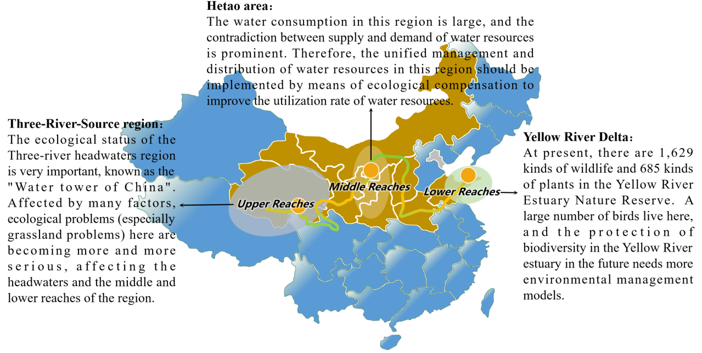

## Overview

1. **Sampling of Cascade Reservoirs in the Yellow River**

At May 2023, we went to the Upper Reaches of Yellow River to explore the influence of cascade reservoirs on the composition of C and N. We collected the samples of water, sediment, and greenhouse gases in Longyangxia, Laxiwa, Lijiaxia, and Liujiaxia reservoirs. The reservoir area, reservoir head, and reservoir tail were all considered.

## Overview

2. **Investigation of the Yellow River Basin**

At July 2022, we went to the Yellow River Delta to explore the eco-compensation mechanism of the Yellow River, financially supported by the Asian Development Bank (TA-6605 PRC:54026-005). The members of the team included the dean of Beijing Normal University Pro. Hongguang Cheng (chg@bnu.edu.cn), the deputy director of Water Safety Research Institute Pro. Changsen Zhao (zhaochangsen@bnu.edu.cn), Pro. Chunhui Li (chunhuili@bnu.edu.cn), and Zhimin Yang (yangzm@mail.bnu.edu.cn).

