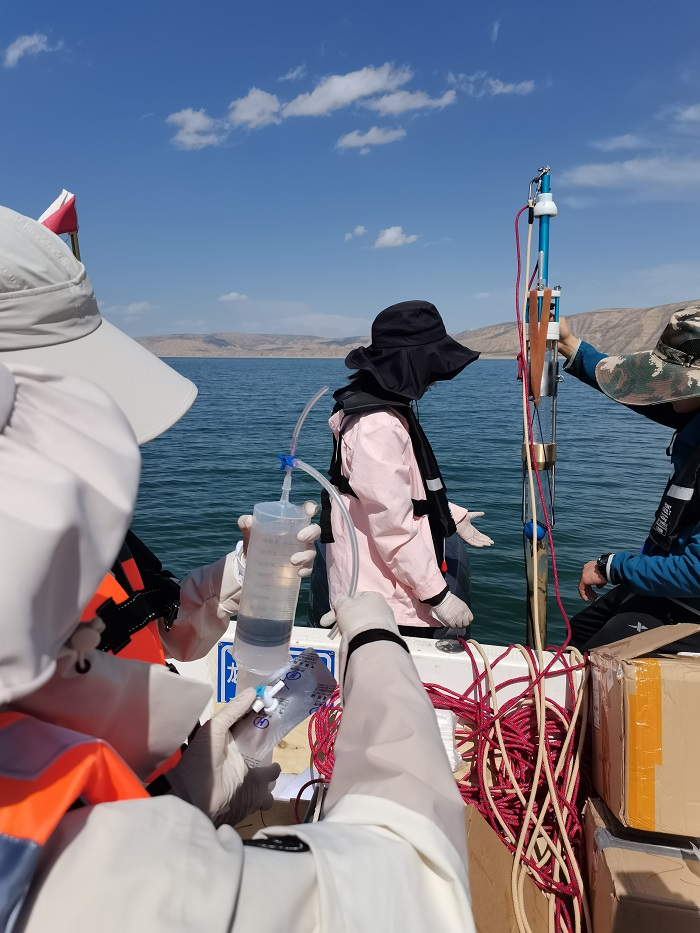
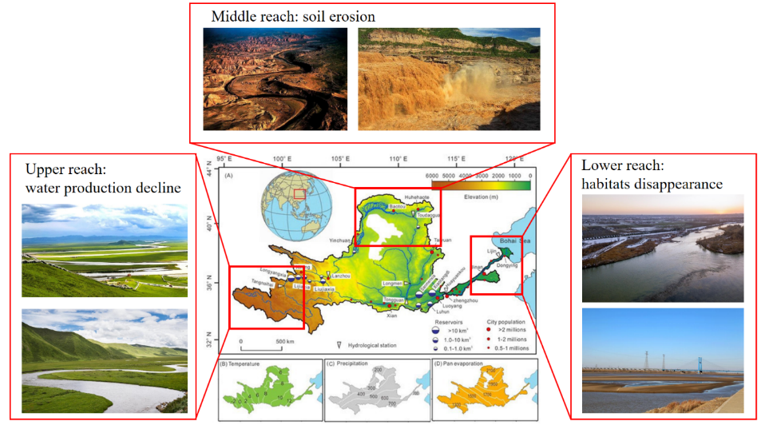

## Overview

1. **Greenhouse gases sampling in the Yellow River**

Zhimin conducted field investigations in the upper reaches of the Yellow River during the spring thaw period (May 2023) and the fall icing period (November 2023) as part of her master's dissertation. Her research focused on the spatial and seasonal characteristics, as well as the mechanisms, of carbon emissions in cascade reservoirs (i.e., Longyangxia, Laxiwa, Lijiaxia, and Liujiaxia reservoirs) and natural river systems.

To achieve this, she collected stratified water samples from various locations, including the dam front, reservoir area, dam tail, and the natural river upstream and downstream. Using the flux chamber method, she collected greenhouse gases at the water-atmosphere interface and determined their diffusion fluxes through gas chromatographic analysis.

To further explore the mechanisms underlying the carbon emission characteristics, Zhimin employed advanced spectroscopic techniques, such as UV-visible spectroscopy, excitation-emission matrices (EEMs), and parallel factor analysis (PARAFAC). These methods allowed her to analyze the spatial distribution, composition, and sources of dissolved organic matter.

These research experiences enhanced her understanding of the impacts of watershed reservoir retention on the transport of riverine biogenic elements and greenhouse gas emissions.

## Overview

2. **Investigation of the Yellow River Basin**

In July 2022, Zhimin participated in a community service project in the Yellow River Delta as part of an Asian Development Bank initiative (TA-6605 PRC: 54026-005). She conducted social research on local residents, industries, government offices, and public service organizations to investigate the impacts of eco-compensation practices and policies on ecosystems and climate change.

Through these activities, Zhimin honed her collaboration and communication skills, enhancing her ability to work effectively with diverse stakeholders.

