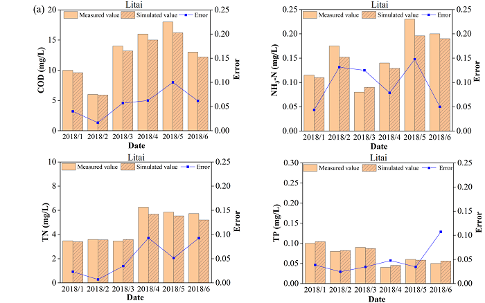

## Model Operation
1. **SWAT model:** 

From the water quality modelling and simulation course taught by [**Professor Ouyang Wei**](https://www.researchgate.net/profile/Wei-Ouyang-6), Zhimin Yang learned how to use the SWAT model and applied it to analyze non-point source pollution in the Luan River Basin. Finally, she got the highest score in this course (Marks: 96/100).

2. **MIKI model:** 

With the support of the Open Fund of State Key Laboratory of Remote Sensing Science hosted by Zhimin Yang, the MIKE model was used to construct a hydrodynamic and water quality model for the Luanhe River Basin in Chengde City to simulate the migration and degradation processes of water pollutants. The relevant research work was submitted to the _Journal of Hydrology_. According to the comments from three independent reviewers, the editor returned the comment of rejection but recommended the author resubmit a revised version through carefully addressing all those comments.

3. **Positive matrix factorization (PMF) model and Unmix:** 

Zhimin Yang combined PMF and Unmix models to apportion sources of HMs. PMF and Unmix were recommended by the U.S. Environmental Protection Agency (U.S. EPA) for source apportionment research. Relatively, Unmix has been scarcely used for source apportionment of HMs in river sediments, and the issue whether they can be used together and what differences are their results remain to be explored. Herein, the two forensic models were jointly applied to quantitatively apportion the potential sources of HMs in the river sediment, and their apportionment results were integratively incorporated into a modified ecological risk index for assessing the source-specific ecological risks of sediment HMs. Similarly, the apportionment results were also used to explore the effects of source-oriented geochemical enrichment of HMs on antibiotic resistome in the environment, and high-throughput sequencing-based metagenomic analysis was employed to characterize the prevalence of antimicrobial resistance.

Regarding this research work, a paper entitled “Source-oriented ecological and resistome risks associated with geochemical enrichment of heavy metals in river sediments” has been published in the _Chemosphere_.

4. **Delft3D model:** 

Zhimin Yang analyzed the influence mechanism of cascade dams on water ecosystems by simulating flow field with Delft3D model in the Yalong River. Considering that the hydrodynamic condition in Yalong River involved many complex ecological and environmental factors, field investigations alone would be insufficient to effectively and accurately analyze the changes of flow field in Yalong River. The well-recognized model can feasibility and realizability simulate the hydrodynamic characteristics based on available data. As the most basic hydrological elements, the variation characteristics of water depth (_h_) and flow velocity (_v_) have fundamental and direct influences on fish species and habitats. Therefore, the Delft3D-Flow module was conducted to simulate the _h_ and _v_ in the study, and all the required input data were imported into this module. The Delft3D-GRID module was used to generate the simulation grid. The alternating direction implicit calculation in the finite difference method was used to solve the equations discretely, including continuity equations and momentum equations as well as transport equations.

Regarding this research work, a paper entitled “A novel index-based method associated with aquatic ecosystem for evaluating river longitudinal connectivity: A case study for cascade dams in the Yalong River, China” has been published in the _Ecological Indicators_.

