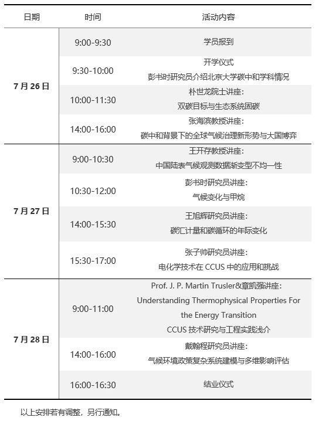
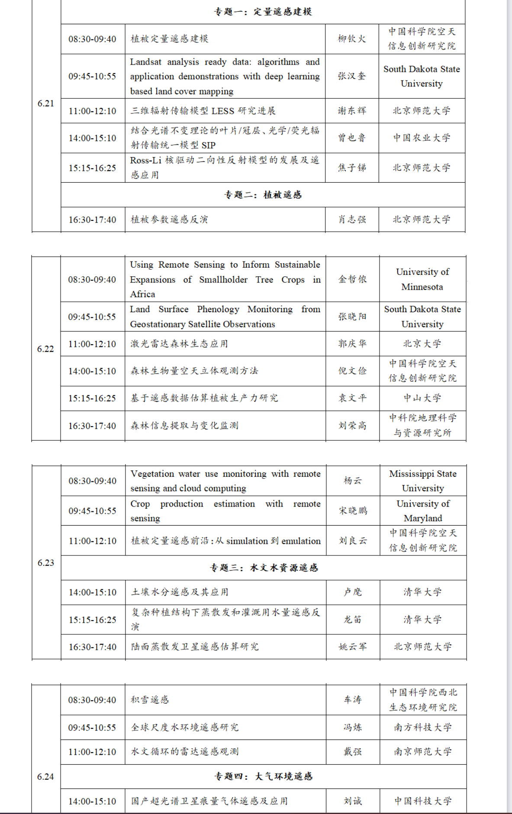
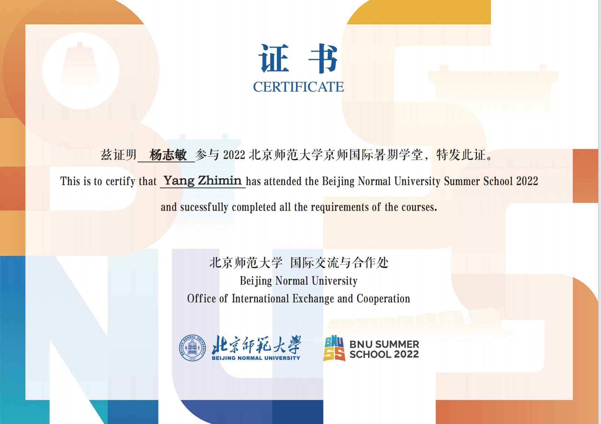

## Summer School Course

1. **Frontiers of Geography–Carbon Neutrality and Climate Change, Peking University, 2023**

During the summer school camp in 2023, Yang Zhimin has learned courses on dual carbon goals and ecosystem carbon sequestration, new global climate governance situations and the game of major powers in the context of carbon neutrality, climate change and methane, carbon sink measurement and interannual changes in carbon cycle, etc; Meanwhile, Yang Zhimin has communicated and discussed with Pro Piano Shilong, Pro Peng shushi.

## Summer School Course

2. **Theory and Methods of Land Surface Remote Sensing Inversion, Beijing Normal University, 2022**

During the summer school camp in 2022, Yang Zhimin has learned quantitative remote sensing of vegetation, soil hydrology remote sensing and its applications, algorithms and application demonstrations with deep learning based land cover mapping, human-nature system coupled models, and other courses. 

## Excellent camper

- 👉 [**click here**](https://www.ues.pku.edu.cn/jyjx/yjsjy/zsxx/78b4f97757934aff9f559d29061a9f4d.htm)
- **Beijing University School of Urban and Environmental Sciences Natural Geography Summer Camp, excellent camper,2020**

-During the summer camp in 2022, Yangzhimin has deeply learned nature geology and communicated with many scholars.

