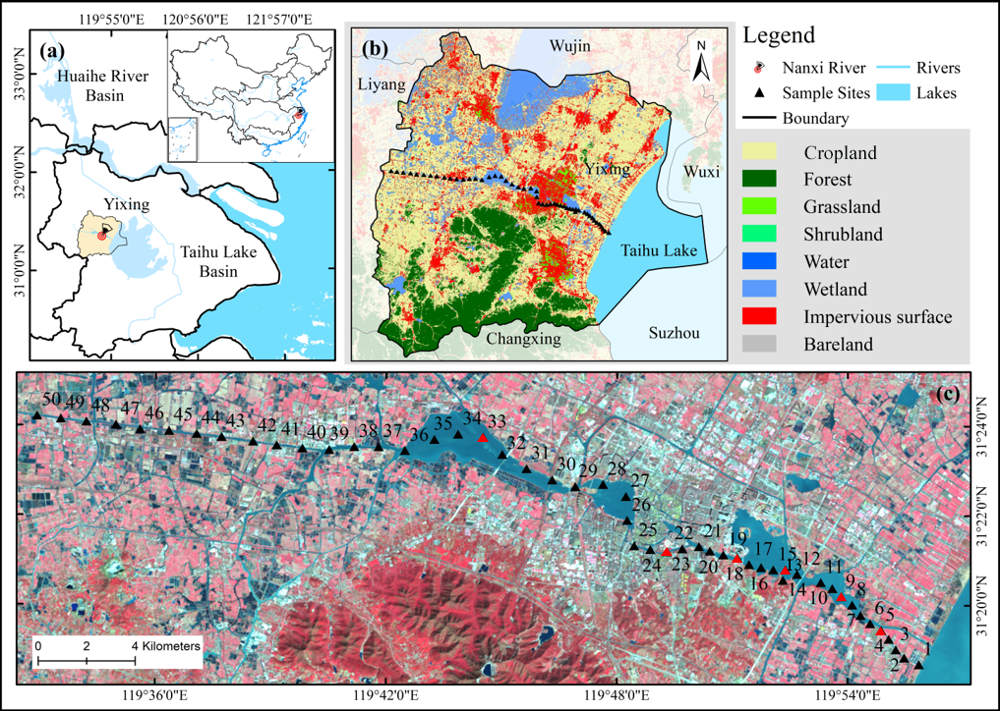
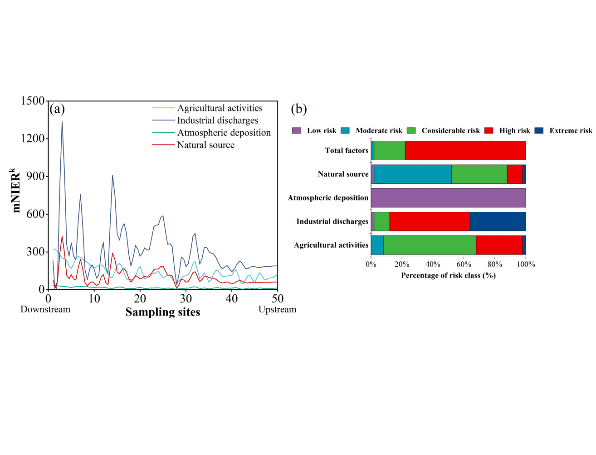

## Keywords :
Heavy metals; Source apportionment; Source-specific ecological risk; Environmental forensic models; Antibiotic resistome risk; River sediments

## Highlights :
- An multidisciplinary-based framework has been proposed for analyzing heavy metal (HM) risks.
- Apportionment results of PMF and Unmix models were similar and complementary.
- Industrial and agricultural sources were the main contributors of HM ecological risks.
- Diverse ARGs were identified and correlated with the geochemical enrichment of HMs.
- This work facilitates the progress of characterizing source-oriented risks of HMs.

## Main content :
Heavy metals (HMs) pose ecological and resistome risks to aquatic systems. To efficiently develop targeted risk mitigation strategies, apportioning HM sources and assessing their source-oriented risks are essential. Although many studies have reported risk assessment and source apportionment of HMs, yet few have explored source-specific ecological and resistome risks associated with geochemical enrichment of HMs in aquatic environments. Therefore, this study proposes an integrated technological framework to characterize source-oriented ecological and resistome risks in the sediments of a plain river in China. Several geochemical tools quantitatively showed Cd and Hg had the highest pollution levels in the environment, with 19.7 and 7.5 times higher than their background values, respectively. Positive matrix factorization (PMF) and Unmix were comparatively used to apportion sources of HMs. Essentially, the two models were complementary and identified similar sources including industrial discharges, agricultural activities, atmospheric deposition and natural background, with contributions of 32.3−37.0%, 8.0−9.0%, 12.1−15.9% and 42.8−43.0%, respectively. To analyze source-specific ecological risks, the apportionment results were integratively incorporated into a modified ecological risk index. The results showed anthropogenic sources were the most significant contributors to the ecological risks. Particularly, industrial discharges majorly contributed high- (44%) and extremely high (52%) ecological risk for Cd, while agricultural activities posed a greater percentage of considerable- (36%) and high- (46%) ecological risk for Hg. Furthermore, the high-throughput sequencing metagenomic analysis identified abundant and diverse antibiotic resistance genes (ARGs), including some carbapenem-resistance genes and emerging genes such as mcr-type in the river sediments. Network and statistical analyses displayed significant correlations between ARGs and geochemical enrichment of HMs (ρ > 0.8; P-value < 0.01), indicating their important impacts on resistome risks in the environment. This study provides useful insights into risk prevention and pollution control of HMs, and the framework can be made applicable to other rivers facing environmental challenges worldwide.

