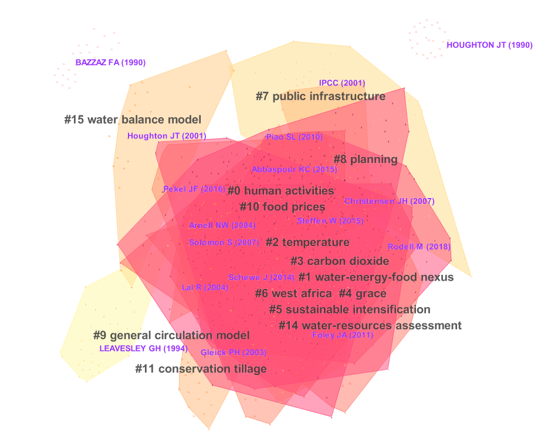
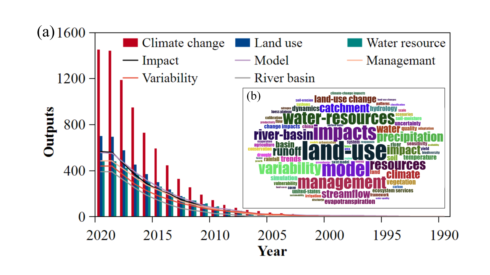

## Keywords :
Water resources; Global environmental change; Research foci and hotspots; Research trends and challenges; Bibliometric analysis

#

## Abstract :
This study provides a comprehensive overview of global water resource research under climate and land use changes from 1990 to 2020. Using bibliometric analysis and traditional literature review, we analyzed trends, hotspots, and challenges in this field. The results reveal a significant growth in research outputs, reflecting increasing global attention to water management issues in a changing environment. Early studies focused on hydrological and ecological modeling at the basin scale, while recent research integrates socio-economic dimensions, such as the water-energy-food nexus and carbon emissions. Notable emerging topics include the use of advanced groundwater monitoring technologies, such as GRACE, and the exploration of trade-offs and synergies within human-water systems. Additionally, the study highlights the need for interdisciplinary and multi-scale approaches to address the complex interactions between climate, land use, and water resources. Key challenges include bridging gaps between research disciplines and improving sustainability practices to enhance global water resilience. This study offers valuable insights and recommendations for future research directions and policymaking, aiming to promote effective and sustainable water resource management in the face of global environmental changes.

##Plain Language Summary:
Understanding how water resources are impacted by climate and land use changes is critical for addressing water shortages and related challenges worldwide. This study examines research on global water resources from 1990 to 2020 using bibliometric methods and traditional reviews. The findings show that research initially focused on hydrology and ecosystems at the basin level. More recent studies have integrated socio-economic aspects, such as the water-energy-food nexus and carbon emissions. Emerging topics include groundwater monitoring technologies like GRACE and the trade-offs between human activities and water systems. The study highlights the need for interdisciplinary approaches to improve water management in a changing environment and provides recommendations to guide future research and policies toward sustainable water resource use.

#

