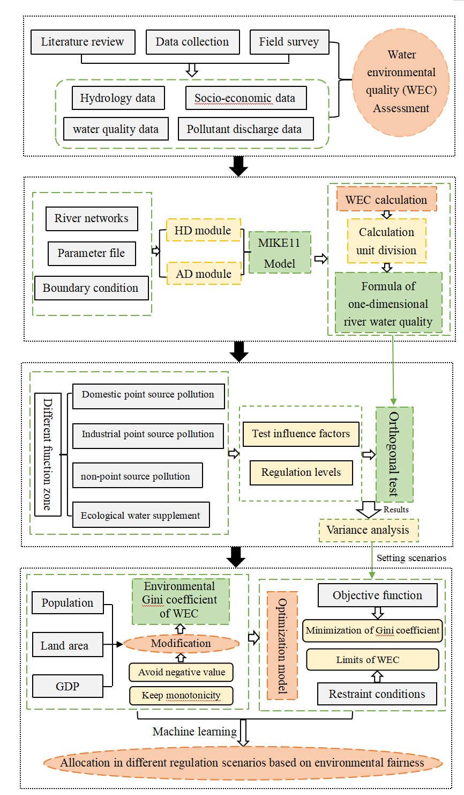

## Keywords :
Water assimilative capacity; Optimization; Modified environmental Gini coefficient; Fairness-efficiency tradeoffs; MIKE11 model

## Highlights :
- A framework for WAC allocation was proposed based on fairness-efficiency.
- The optimal allocation is in the moderate regulation with minimal objective function.
- High regulation is ideal for fairness-based allocation.
- Targeted regulation prioritizes key pollutants and specific river sections.

## Abstract :
Water assimilative capacity (WAC) is crucial metric for evaluating the effective control of total pollutant loads. However, the allocation of pollutant discharges remains a complex challenge due to uncertainties and tradeoffs between environmental fairness and efficiency. To address these issues, this study proposed a novel integrated framework for the optimal allocation of WAC based on fairness-efficiency tradeoffs. The framework was applied to the Luan River Basin in Chengde City, China, as a case study to illustrate its application. The study area was divided into five water environmental function zones and eight calculation units. Four water quality indices (i.e. COD, NH3-N, TN, and TP) were selected as pollutant control targets. Hydrodynamic and advection-dispersion modules from the MIKE 11 model were developed and integrated into the WAC model. An orthogonal experiment method was conducted to identify significant factors influencing WAC. Three regulatory levels were set for significant factors based on four regulatory aspects, thereby three regulatory scenarios were designed. To assess the performance of WAC allocation, the Environmental Gini coefficient (EGC) was modified using a probability distribution function to evaluate fairness; and the environmental benefit was used to quantitatively measure allocation efficiency. Therefore, a modified optimization model was developed to determine the optimal allocation of WAC. The objective function aimed to minimize the ratio of the variation in the modified EGC to the variation in environmental benefits. The results showed that the initial state presented the least favorable condition, with the lowest WAC and highest modified EGC. Comparatively, WAC values under the high regulatory scenario were 8.61, 1.53, and 0.43 times greater than those in the initial state, low, and moderate regulatory scenarios, respectively. Furthermore, the average modified EGC under high regulation was reduced by 68.97%, 53.49% and 18.22% compare to the initial state, low, and moderate regulation, respectively. Therefore, the ideal allocation was observed in the high regulation based on environmental fairness. However, when considering fairness-efficiency tradeoffs, the optimal allocation of WAC occurred in the moderate regulation due to a minimal objective function, with the value 68.64% smaller than that of the high regulation. The study provides new insights into targeted WAC allocation strategies to promote fairness and maintain efficiency.

