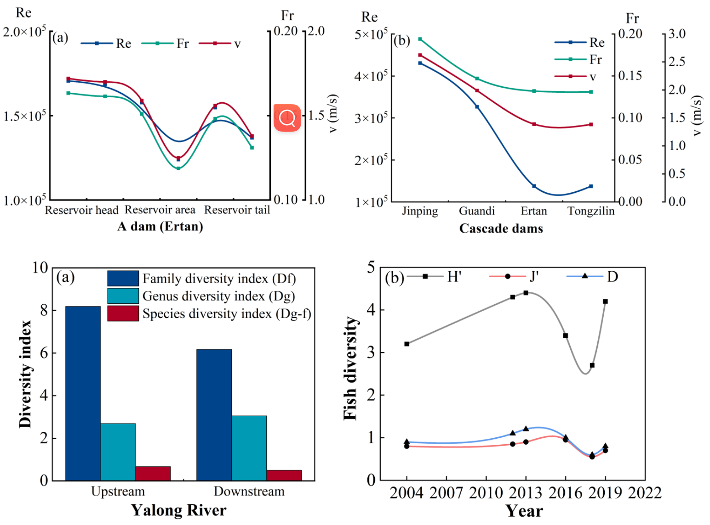
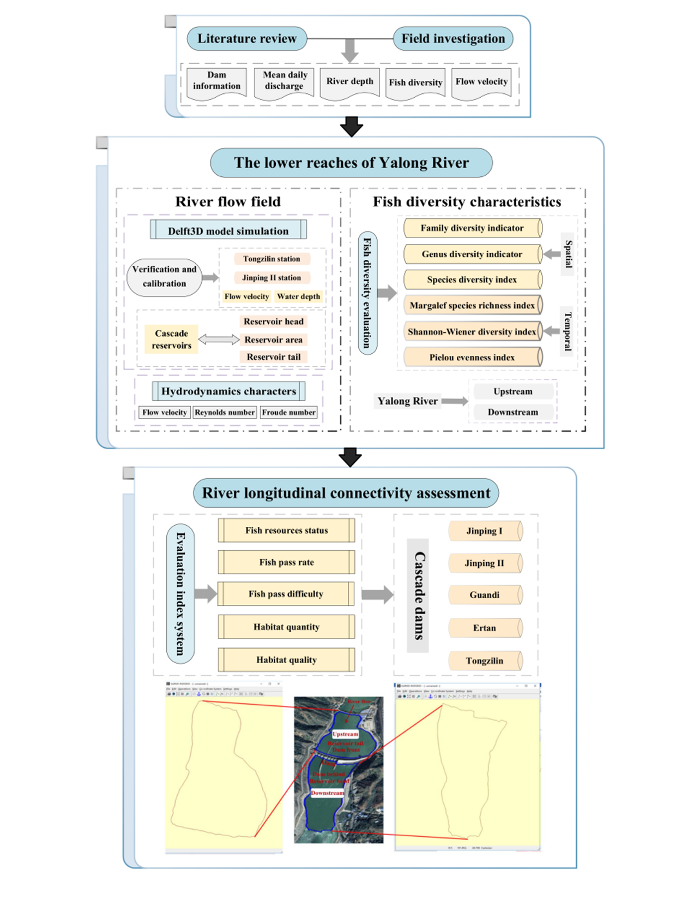

## Keywords :
River longitudinal connectivity; Cascade dams; Flow regime; Fish diversity; The Yalong River

## Highlights :
- An index-based method associated with aquatic ecosystem was proposed to evaluate RLC.
- The changes of flow regime in cascade dams impacted the migratory and endemic fish.
- The downstream Tongzilin reservoir had the largest contribution to the loss of RLC.
- RLC was impacted by multiple factors especially cumulative effects in cascade dams.

## Main content :
Dams as crucial metrics for characterizing aquatic species diversity and river ecosystem have significant effects on river longitudinal connectivity (RLC). Specially, the reduction of RLC can lead to the degradation of suitable habitats and loss of migration opportunities for freshwater fish. However, the assessment of RLC in cascade dams is still limited, particularly in relation to fish species and habitats. Therefore, this paper analyzed the influence mechanism of cascade dams on aquatic ecosystems by simulating the flow field using the Delft3D model. Additionally, a novel index-based method associated with five fish-related indices has been developed to evaluate the RLC. Considering that numerous large dams posed serious threats to the aquatic ecosystem in Southwest China, the Yalong River was chosen as a study case to illustrate the application of this new framework. The results showed that the reservoir area exhibited the most stable flow field, with the lowest values of flow velocity (v), Reynolds number (Re) and Froude number (Fr); and the highest hydrodynamic parameters were observed at the reservoir head. The v from upstream to downstream of the five studied reservoirs (Jinping I, Jinping II, Guandi, Ertan and Tongzilin) showed a decreasing trend, characterized by turbulent flow (Re>500) and sluggish flow (Fr<1). These changes in flow regime had a profound impact on fish diversity and habitats due to the construction of cascade dams. Based on the novel index-based method, the RLC was determined to be moderate, with a value of 12.90. Notably, the lowest score occurred in the Tongzilin reservoir, indicating its largest contribution to the reduction of RLC. The different impacts of the five studied dams on RLC were attributed to multiple factors, including their geographical location, distribution, distance, reservoir operations and regulations, as well as the cumulative effects of cascade dams. The results can provide references for decision-making in dam projects and river management, and the framework can be applied to evaluate RLC of other rivers worldwide.

